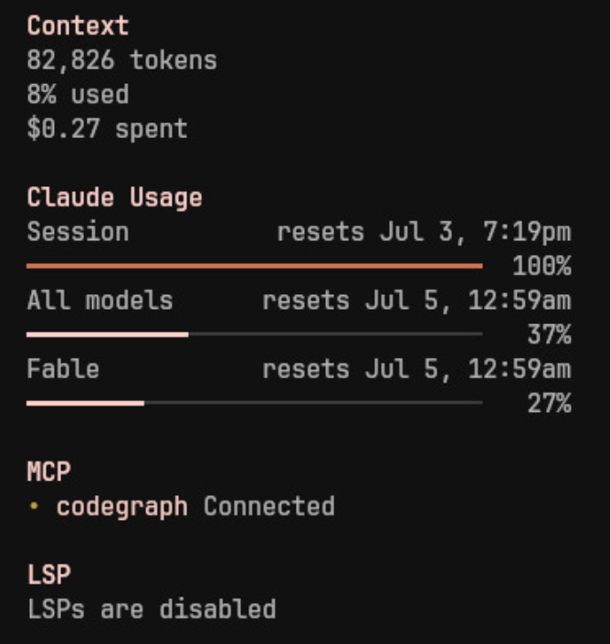

# opencode-usage-bar

Claude usage bars in the OpenCode TUI sidebar.



It adds progress bars to the sidebar for your Claude usage limits:

- Session and weekly usage
- Reset time for each limit
- Bar color turns yellow past 70% and red past 90%

## Requirements

- OpenCode `>=1.15.0` (it may work with older versions, but it's untested)
- The [`claude`](https://docs.anthropic.com/en/docs/claude-code) CLI, installed
  and logged in. The plugin reads usage by running the `/usage` command.

## Installation

Install from the CLI:

```
opencode plugin opencode-usage-bar
```

Or from OpenCode commands:

1. Press `Ctrl+P`
2. Select `Install Plugin`
3. Enter `opencode-usage-bar`

## Local use

Point a TUI config at the package directory:

```json
{
    "$schema": "https://opencode.ai/tui.json",
    "plugin": ["../"]
}
```

The package exports its TUI entry at `./tui`.
